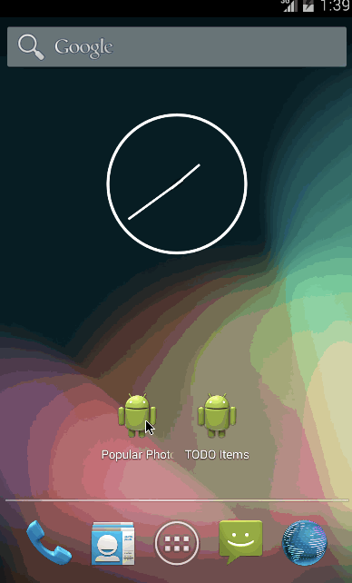

Android-Instagram-Viewer
========================

An app to display the current popular items on Instagram; the week 1 CodePath assignment.

Time spent: 2.5 hours

# Completed user stories
* [x] Required: user can scroll through photos from Instagram
* [x] Required: photos show graphic, caption, username
* [x] Additional: user photo
* [x] Additional: loading spinner bridges gap from application launch

# User scrolling, showing graphic, caption, username, user photo

# Loading spinner

